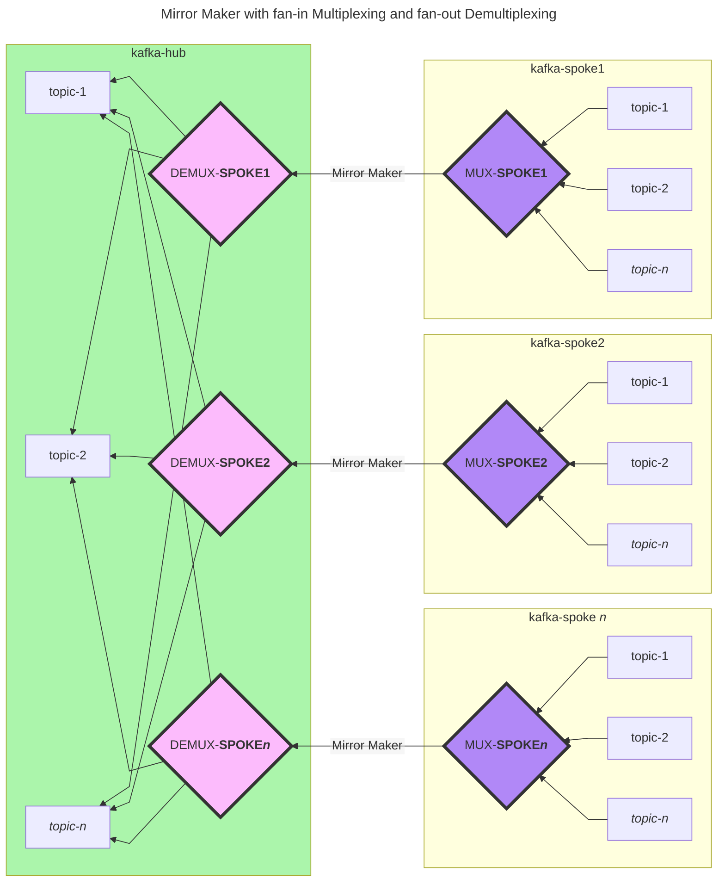

# POC-MultiplexKafkaMirrorMaker
A POC for mux/demux of remote kafka topics in a hub/spoke architecture.

## Problem Statemen
A recent job interview asked about the ability to efficiently replicate multiple Kafka topics from separate regions to a centralized kafka instance. The solution needed to be scalable, as many separate kafka instances across many regions existed, and there were plans to add more.  I considered it a Hub - Spoke archtecture, a design principle I have experienced many, many years ago as a Lotus Notes Domino Server engineer (I **told** you it was many years ago!). Being new to Kafka & Mirror Maker I threw up a working POC.

## Diagram of solution


## Kafka headers added by SpokeMultiplexer
In order to retain the original messages' attributes, we can leverage kafka headers. The following headers are injected in the POC, but can be expanded upon if desired:
| Header                       | Description |
| ---------------------------- | ------------------------------------------------------------|
| MUX_SOURCE_TOPIC             | Initial Source topic of message (used later for demux)      |
| MUX_SOURCE_TOPIC_PARTITION   | Initial Source partition of message (used later for demux)  |
| MUX_SOURCE_TIMESTAMP         | Initial Source timestamp of message  |
| MUX_SOURCE_BOOTSTRAP_SERVERS | Bootstrap server used by multiplexer  |
| MUX_INTERMEDIATE_TOPIC       | The topic the multiplexer will produce a message on (later replicated to the kafka hub via mirror maker  |
| MUX_SOURCE_IDENTIFIER        | Appened to MUX_INTERMEDIATE_TOPIC a "friendly" name to describe the source kafka instance.|
| MUX_SOURCE_CLUSTER_ID        | Not in POC, but we could use the adminClient.DescribeCluster() for the metadata.ClusterID if this is desired|


## How to run
```bash
docker compose up
```
We launch three instances of `kafka-ui`. [kafka-hub](https://localhost:8080), [kafka-spoke1](https://localhost:8180 & [kafka-spoke2](https://localhost:8280) exposed on ports 8080, 8180 & 8280 respectively. These bootstrap to our `kafka-hub`, `kafka-spoke1`, `kafka-spoke2` instances.
Each spoke runs three containers that produce messages on an unreplicated topic (`nonreplicated`) & two replicated topics (`topic` & `topic2`). If additional messages are required you can `docker restart` any of the relevant containers `producer-spoke1`, `producer-spoke1-replicated`, `producer-spoke1-replicated2`, `producer-spoke2`, `producer-spoke2-replicated` or `producer-spoke2-replicated2`\

## Images that are built
### SpokeProduceEvents
A small golang app that produces messages, uses [confluent-kafka-go](https://github.com/confluentinc/confluent-kafka-go) library

### SpokeMultiplexer
A small golang app that produces multiplexes messages from one or more topics, and produces them on to an intermediate topic for mirror maker replication. Again uses [confluent-kafka-go](https://github.com/confluentinc/confluent-kafka-go)

### HubDemultiplexer
A small golang app that produces demultiplexes messages from one intermediate topic that mirror maker replicated. Based on the [headers](#Kafka-headers-added-by-SpokeMultiplexer) added, will produce events with the same topic/partition as the source kafka instance. Again uses [confluent-kafka-go](https://github.com/confluentinc/confluent-kafka-go)

### MirrorMaker
A custom kafka mirror maker connect image that allows us to configure group.id, replication factors, config/offset/storage topics etc. This allows us to run multiple mirror maker instances to the same kafka instance.

## Caveat Emptor!
This is a very rudimentary mock-up. I've explcitly set a number of **sub-optimal** configurations, and production use would require a rewrite. There are no tests written and some old kafka versions. Nevertheless it was a fun/interesting learning experience. Within mirror maker, we could have written to a shared topic. However for reasons of offset management, scale and separation of concerns I decided an intermediate topic per replication source was probably best e.g. `mux-replication_spoke1` & `mux-replication_spoke2`

## References
https://github.com/confluentinc/confluent-kafka-go/tree/master/examples

https://docs.confluent.io/platform/current/connect/references/allconfigs.html#

